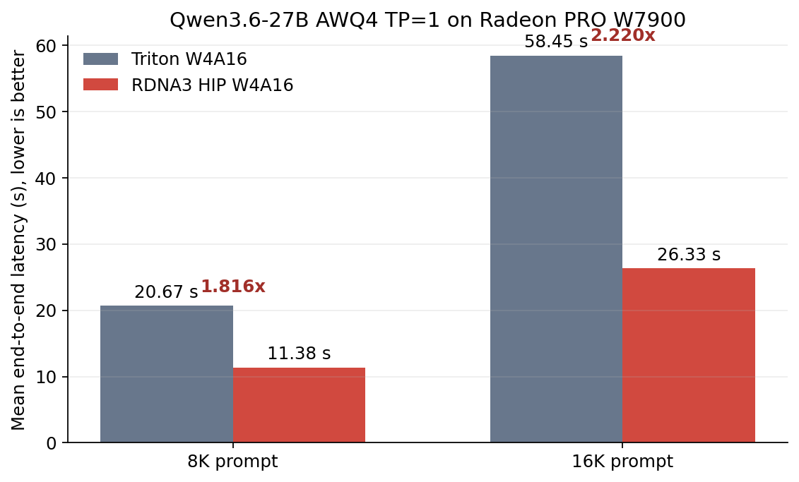
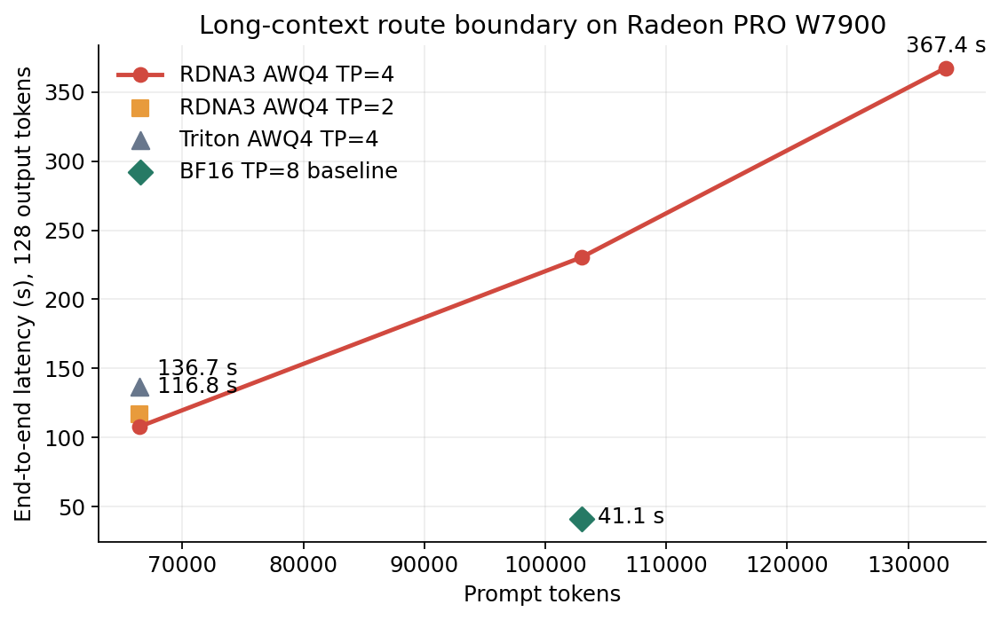

# AWQ4 + DFlash 双平台实验结果

## 1. 问题与方法

Strix Halo 和 W7900 同属 RDNA 3/3.5，但内存与部署目标不同。Strix Halo 依靠 128 GB UMA 在单设备上容纳模型与超长 KV cache；W7900 是每卡 48 GiB 的离散显存节点，需要显式处理 TP 通信、NUMA/PCIe 拓扑、KV 分片和多实例资源划分。

本项目采用四层优化：W4A16 HIP 融合反量化与矩阵乘、Triton unified attention 的 gfx1100 tile 调优、DFlash 的上下文感知开关，以及 BF16/AWQ4/TP/多实例之间的负载路由。

## 2. Strix Halo

| 技术 | 实验结果 |
|---|---:|
| BF16 基线 | 4.3 token/s decode |
| AWQ4 | 5.6 token/s decode |
| AWQ4 + DFlash N=8 | 28.3 token/s peak，约 20 token/s mean |
| 3 并发 | 41 token/s peak aggregate |
| gfx1151 HIP W4A16 | 4K prefill 约 3.4×；32K 约 2.8× |
| 3D Split-K | 32K decode 3.4 → 6.7 token/s |

完整正确性和五项精度对比位于 `test/results/accuracy/` 与 `test/results/competition/`。峰值、均值和端到端吞吐含义不同，报告中不混用。

## 3. W7900

### 3.1 Attention tile

| 指标 | tile=32 | tile=16 |
|---|---:|---:|
| VGPR | 224 | 176 |
| standalone kernel 平均时间 | 1021.95 ms | 998.00 ms |
| 24K AWQ4 热态服务 wall | baseline | 下降 11.5% |

tile=16 降低每线程寄存器压力，为更高 wave 并发提供条件。standalone 仅改善 2.3%，而服务改善 11.5%，说明端到端结果还受实际 shape 与调度联动影响。

### 3.2 RDNA3 HIP W4A16 边界

| 输入 | Triton | RDNA3 HIP | 加速 |
|---:|---:|---:|---:|
| 8K | 20.671 s | 11.383 s | 1.816× |
| 16K | 58.451 s | 26.332 s | 2.220× |
| 66K, TP=4 | 136.66 s | 106.42 s | 1.284× |

内核对 8–16K prefill 最有价值，66K 收益仍为正但明显收窄。dispatcher 应基于 M/shape/TP 选择后端，不能把 `large-M` 作为单一阈值。

### 3.3 DFlash 路由

| 输入 | 相对无 DFlash |
|---:|---:|
| 8K | 快 33.6% |
| 12K | 快 4.4% |
| 16K | 慢 6.6% |

DFlash 的候选生成开销和目标模型 verify 成本随上下文增长，16K 已出现负收益。其主要价值区间是短上下文 decode。

### 3.4 多卡与长文

| 实验 | 结果 |
|---|---:|
| 102.9K BF16 TP=2/4/8 | 261.947 / 133.261 / 67.977 s |
| 双 BF16 TP=4 | 159.66 output token/s |
| 单 BF16 TP=8 | 129.66 output token/s |
| 102,994 tokens, BF16 TP=8 vs AWQ4 TP=4 | 40.698 vs 230.418 s；BF16 快 5.662× |
| 128,769 tokens, BF16 TP=8 vs AWQ4 TP=4 | 54.879 vs 340.485 s；BF16 快 6.204× |

结论不是 AWQ4 无效，而是工作区间不同：AWQ4/HIP 适合较少卡和短中 prefill；100K+ 科研长文需要 BF16 TP=8 的计算与并行度。

### 3.5 KV cache

FP8 KV 容量约为 auto KV 的 1.99×，但在同类单请求实验中更慢。它应作为达到 256K 或增加并发容量的手段，而不是默认速度优化。

## 4. 科研长文质量

| 配置 | 32K QA | 32K wall | 64K QA | 64K Needle | 64K wall |
|---|---:|---:|---:|---:|---:|
| BF16 TP=8 | 94.79% | 10.933 s | 96.67% | 100% | 22.674 s |
| AWQ4 TP=4 | 96.88% | 26.523 s | 88.33% | 75% | 63.304 s |

AWQ4 64K 中一项失败来自 256-token 输出截断，扩展到 512 token 后恢复；另有近文末标识符少复制一位的确定性错误。测评工具因此分别报告内容质量、输出预算和精确字符串回归。

## 5. 证据边界

容器中 `_rocm_sdk_devel` 与 `_rocm_sdk_core` 两套 SDK 的 `librocprofiler-sdk.so.1` 冲突，真实 vLLM attach 会 signal 6。当前已成功获得单进程 PID 分片和 `torchrun` TP=2 trace，但未获得可声明的真实请求内 W4A16/attention/RCCL 百分比。完整原始口径和失败记录见 [W7900 第一阶段报告](W7900_FULL_EXPERIMENT_REPORT.md) 与 [质量/profiler 说明](W7900_QUALITY_AND_ROCPROF.md)。
