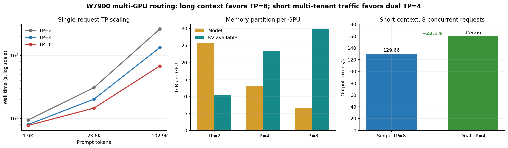
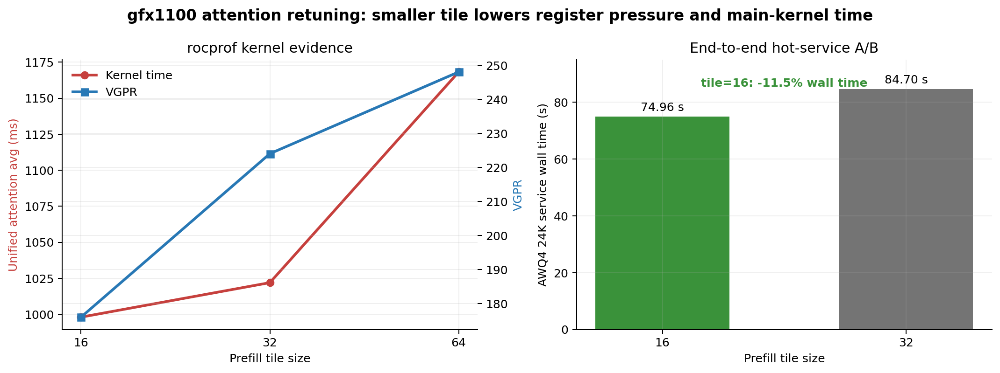
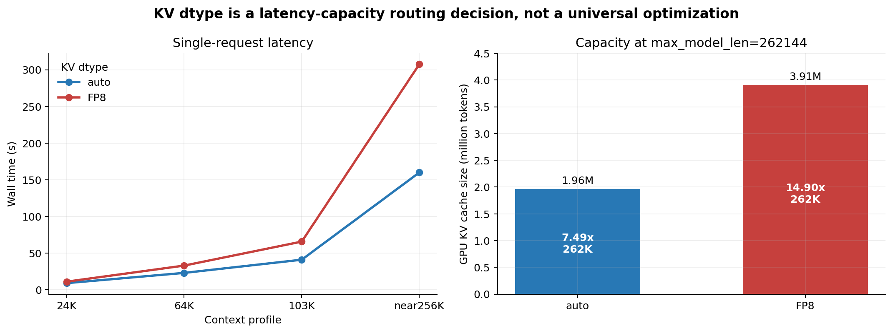
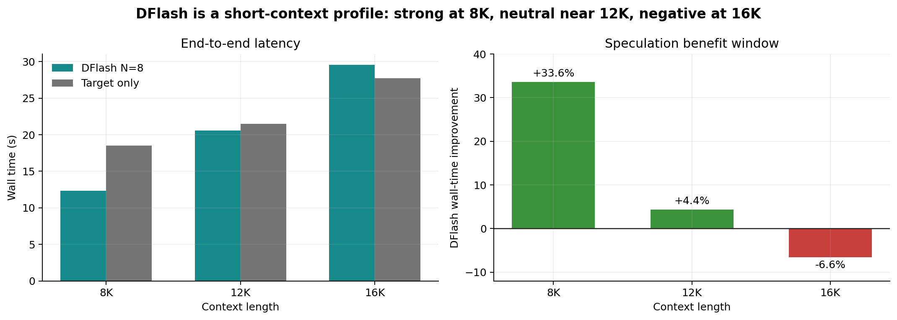
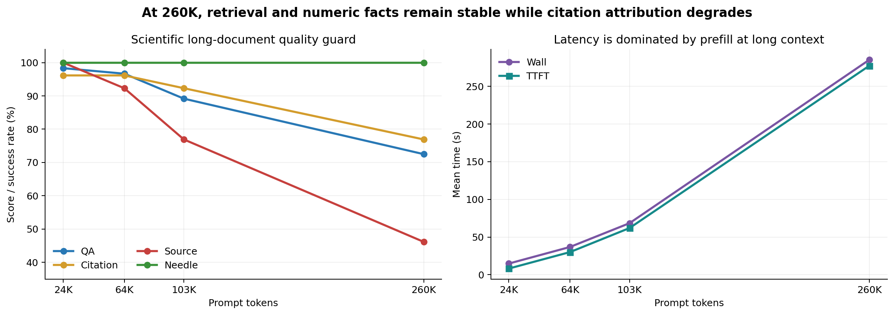
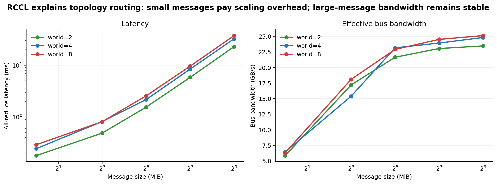
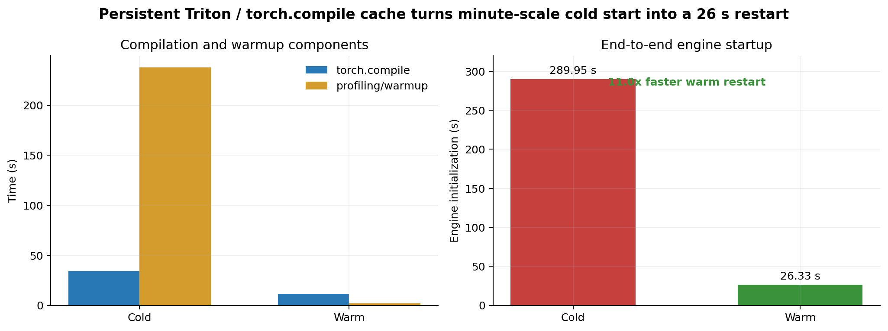

# AMD Radeon PRO W7900 多卡大模型推理优化完整实验报告

日期：2026-07-30<br>
平台：单节点 8 × AMD Radeon PRO W7900D，`gfx1100`，48 GiB/卡<br>
模型：Qwen3.6-27B BF16、Qwen3.6-27B AWQ4、Qwen3.6 DFlash drafter<br>
框架：AMD ROCm 7.14、PyTorch 2.11、Triton 3.7.1、vLLM 0.23.1.dev1

本文档合并并取代以下阶段性总结中的重复叙述：

- `w7900_phase1_summary_20260730/W7900第一阶段实验大总结_20260730.md`
- `w7900_rdna3_awq4_phase2_20260730/W7900_AWQ4_RDNA3第二阶段关键实验总结_20260730.md`
- `w7900_rdna3_awq4_phase2_20260730/W7900_第三阶段增量实验记录_20260730_晚.md`
- `w7900_rdna3_awq4_asymmetric_kernel_20260730.md`

本文只记录已经完成并具有实验或源码证据的技术实现、正负结果、机制分析和结论边界。

---

## 摘要

AMD Radeon PRO W7900 是基于 RDNA 3、具有 48 GiB 独立显存的专业显卡。8 卡节点能够提供 384 GiB 总显存，但与 Strix Halo 统一内存平台相比，其推理优化问题发生了根本变化：模型权重和 KV Cache 必须在多张独立显卡之间分片，每层张量并行会引入 RCCL 集合通信，短请求可能无法摊薄多卡调度成本，而长上下文又会使注意力计算和 KV 容量迅速成为主导瓶颈。因此，本阶段工作的目标不是把 UMA 平台参数机械复制到 W7900，而是围绕 `gfx1100` 微架构、离散显存和多卡拓扑重新建立 Qwen3.6-27B 的推理路径。

实验覆盖 BF16 与 AWQ4 两种权重精度、TP=2/4/8、双 TP=4 多实例、Triton unified attention、ROCM_ATTN、auto/FP8 KV Cache、DFlash N=8、RDNA3 W4A16 HIP 后端、RCCL All-Reduce、编译缓存以及 24K–260K 科研长文质量测评。主要结论如下：

1. **100K 以上科研长文的低时延主路线是 BF16 TP=8。** 在统一 harness 下，102,994-token 请求的 BF16 TP=8 热态时延为 `40.698 ± 0.316 s`，AWQ4 RDNA3 TP=4 为 `230.418 s`，BF16 快 `5.662×`；128,769-token 时分别为 `54.879 ± 0.103 s` 和 `340.485 s`，BF16 快 `6.204×`。
2. **短请求应减少单实例通信跨度。** 两个独立 TP=4 服务在 8 路短请求下达到 `159.66 output token/s`，比单 TP=8 的 `129.66 token/s` 高 `23.1%`。
3. **`gfx1100` 的 unified attention 需要重新调优。** 将 prefill tile 从 32 改为 16 后，VGPR 从 224 降至 176，standalone 主内核平均时间从 `1021.95 ms` 降至 `998.00 ms`；AWQ4 24K 热态服务时延下降 `11.5%`。
4. **自研 RDNA3 W4A16 后端已经完成整模型闭环。** 在单卡 8K 和 16K 预填充中，相比 Triton W4A16 分别加速 `1.816×` 和 `2.220×`；66K TP=4 同服务对照中仍快 `1.284×`。因此 AWQ4 长文退化不是 HIP 线性算子失效，而是 AWQ4 多卡整条执行路径的共同瓶颈。
5. **KV 精度与 DFlash 均具有明确适用区间。** FP8 KV 将 262K 理论并发由 `7.49×` 提高到 `14.90×`，但 near-256K 单请求时延由 `159.89 s` 增加到 `307.52 s`；DFlash 在 8K 快 `33.6%`，12K 快 `4.4%`，16K 慢 `6.6%`。
6. **极长上下文的主要质量风险是来源归因，而不是简单的事实定位失败。** 24K–260K 测试中 needle、数值和拒答保持稳定，但 source accuracy 从 24K 的 `100%` 降至 260K 的 `46.15%`。

这些结果表明，W7900 节点不应使用单一固定配置，而应根据上下文长度、卡数、并发目标和显存目标选择不同的服务 profile。

---

## 1. 实验动机与问题定义

### 1.1 从统一内存迁移到离散多卡后的问题变化

Strix Halo 路线的主要约束是有限计算单元、统一内存带宽和本地功耗。W7900 节点虽然具有更强总算力和更高总显存，但每张卡只有自己的 48 GiB 显存，模型分片之间必须通过 PCIe/RCCL 通信。由此产生三个相互耦合的问题：

- **权重与 KV 的显存分配问题。** TP 越大，每卡权重越少，KV 空间越大；但参与通信的 GPU 越多。
- **计算与通信的负载相关性。** 长 prefill 具有足够计算量，可以从更多 GPU 获益；短 decode 和小 batch 更容易被 collective 固定延迟支配。
- **微架构与算子匹配问题。** W7900 是 `gfx1100`、Wave32 的 RDNA 3 GPU，Triton/HIP kernel 的 tile、VGPR 和 LDS 使用不能直接沿用 CDNA 或 `gfx1151` 的参数。

因此，本阶段围绕以下实验问题组织：

1. Qwen3.6-27B 全量 BF16 模型能否在 TP=2/4/8 下稳定运行，并表现出可解释的扩展规律？
2. 8 卡节点应部署一个 TP=8 服务，还是拆分成多个较小 TP 实例？
3. `kernel_unified_attention` 在 `gfx1100` 上的 tile、2D/3D launch 和后端选择如何影响资源占用与端到端时延？
4. AWQ4 的 RDNA3 HIP W4A16 路径能否支持真实 `compressed-tensors` 非对称量化权重，并进入完整 vLLM 服务？
5. auto/FP8 KV 与 DFlash 在什么上下文范围内产生速度或容量收益？
6. 24K–260K 科研长文中，性能扩展是否伴随事实、引用或来源归因能力下降？

### 1.2 评价层次

为了避免用单个吞吐数字替代系统分析，本文将证据分为三层：

| 层次 | 主要对象 | 主要指标 |
|---|---|---|
| 内核级 | W4A16、unified attention、RCCL | VGPR、SGPR、kernel time、Relative L2、All-Reduce 延迟与带宽 |
| 引擎级 | vLLM、TP、KV、DFlash、编译缓存 | TTFT、wall time、input/output throughput、KV tokens、engine init |
| 任务级 | 科研长文问答与归因 | QA、JSON、citation、evidence、source、needle、numeric、abstention |

---

## 2. 硬件、软件与上游代码基线

### 2.1 硬件与拓扑

| 项目 | 配置 |
|---|---|
| GPU | 8 × AMD Radeon PRO W7900D |
| 架构 | `gfx1100`，RDNA 3，Wave32 |
| 显存 | 48 GiB/卡，共 384 GiB |
| NUMA | GPU 0–3 位于 NUMA 0；GPU 4–7 位于 NUMA 1 |
| 长文 TP=4 放置 | 优先使用 GPU 0–3 或 GPU 4–7，保持同 NUMA |
| 双实例放置 | 服务 A 使用 GPU 0–3；服务 B 使用 GPU 4–7 |

该拓扑使 TP=4 可以限制在单一 NUMA 域内，而 TP=8 必然跨越两个 NUMA 域。双 TP=4 实验同时利用了这种物理分组。

### 2.2 容器与软件版本

主容器镜像为：

```text
rocm/vllm:rocm7.14.0_rdna_ubuntu24.04_py3.14_pytorch_2.11.0_vllm_0.23.0
```

实际运行日志中的核心版本为：

| 组件 | 版本或状态 |
|---|---|
| ROCm | 7.14.0 |
| PyTorch | 2.11.0+rocm7.14.0 |
| vLLM | 0.23.1.dev1 |
| Triton | 3.7.1 |
| RCCL | 2.30.4 |
| vLLM engine | V1 engine，支持 full/piecewise CUDAGraph 与 chunked prefill |
| TP 通信 | `disable_custom_all_reduce=True`，使用 PyNCCL/RCCL 路径 |

BF16 与 AWQ4 工作树均以 AMD 提供的 vLLM 0.23 开发基线为基础，远程主要工作目录为 `/workspace/vllm-w7900-023`。模型和 tokenizer 完全离线加载，避免网络状态影响实验。

### 2.3 使用的模型与数据

| 类型 | 内容 |
|---|---|
| BF16 target | `/models/Qwen3.6-27B` 全量权重 |
| AWQ4 target | Qwen3.6-27B，`compressed-tensors`，INT4，group size 32，非对称 zero point |
| Drafter | Qwen3.6 DFlash draft model |
| 常规长文 | `combined_papers_for_llm.txt` |
| 极长文本 | `combined_papers_for_llm_L.txt` |
| 科研质量材料 | 基于 Nowcast3D 论文构建的 evidence、needle、numeric 和 abstention 测试集 |

66K、103K 和 133K 并非人为选择的特殊长度，而是实际论文组合文本经过 tokenizer 后的自然落点。额外的 64,446-token 和 128,769-token 规则长度实验与 66,421-token、133,115-token 自然长度结果一致，说明这些长文点可以分别映射到常见的 64K 和 128K 系统档位。

### 2.4 vLLM 上游分支与补丁来源

W7900 基线没有无选择地叠加所有开放补丁，而是只引入了能够明确验证的上游代码和本项目修改。

#### 2.4.1 DFlash 主线来源

DFlash 于 2026-03-30 通过 vLLM [PR #36847](https://github.com/vllm-project/vllm/pull/36847) 合入主线。本项目使用 vLLM 0.23 基线中已经存在的 Qwen3 DFlash、`draft_tensor_parallel_size` 和 speculative config 结构。

#### 2.4.2 Hybrid attention/Mamba KV 页面修复

Qwen3.6 包含 hybrid attention、GDN/Mamba 状态与普通 attention KV。为避免 Mamba page 被错误放大 block size，W7900 工作树回移植了已合并的 vLLM [PR #45207](https://github.com/vllm-project/vllm/pull/45207)：

```text
merge commit: 55da232db6963613d34229dfd257236e6f3c8097
```

具体实现位于：

```text
codes/vllm-awq4-qwen-1.0-main/w7900_optimization/patch_w7900.py
```

该修复使用 `page_size_padded=max_page_size` 对齐 Mamba 物理页，同时保留其缓存粒度，解决 Qwen3.6 hybrid KV group 的 page-size 统一问题。

#### 2.4.3 Strix Halo attention 分支的继承关系

原项目针对 DFlash 非因果多查询验证和 3D launch gate 的修改以 vLLM [PR #44652](https://github.com/vllm-project/vllm/pull/44652) 提交。W7900 分支继承了“非因果验证与长序列 Split-K 应由形状决定”的设计思想，但本阶段的主要改动是把 `gfx1100` tile 与 2D/3D launch 阈值暴露为可控参数，并重新做端到端与 rocprof 对照。

原项目还向 vLLM [Issue #43626](https://github.com/vllm-project/vllm/issues/43626) 和 [PR #37429](https://github.com/vllm-project/vllm/pull/37429) 提供了混合 KV page-size、KVBlockZeroer 和 FP8 KV 的跨设备复现信息。W7900 基线没有直接应用仍开放或未合并的 #37429，而是使用已合并 #45207 建立可审计基线。

#### 2.4.4 W7900 attention tunables

`patch_w7900.py` 为 vLLM Triton attention 增加以下环境变量：

```text
VLLM_TRITON_ATTN_PREFILL_TILE_SIZE
VLLM_TRITON_ATTN_DECODE_TILE_SIZE
VLLM_TRITON_ATTN_MIN_2D_GRID
VLLM_TRITON_ATTN_SOFTMAX_SEGMENTS
```

其中 tile 必须为正的 2 次幂；2D grid 阈值和 softmax segment 数必须为正整数。这样可以在不反复修改源码的情况下对 `gfx1100` 进行 16/32/64 tile A/B，并保持实验配置可追踪。

---

## 3. 关键技术实现

### 3.1 Triton unified attention 的 `gfx1100` 重调优

Qwen3.6 的长上下文 attention 在 prefill 阶段处理大量 query token，在 decode 阶段则需要扫描不断增长的 KV Cache。Triton unified attention 的 tile 决定每个 program instance 处理的 key/value 范围，也直接影响线程需要保存的中间向量、VGPR 数量和可驻留 wave 数。

W7900 分支保留 vLLM 的 unified attention 数学流程，只改变可控调度参数：

- prefill tile：16、32、64；
- decode tile：保持与 dtype/head shape 兼容的默认路径；
- 2D/3D launch gate：通过 `MIN_LAUNCH_GRID_SIZE_2D` 控制；
- Split-K 后的 parallel softmax segment：通过 `NUM_PAR_SOFTMAX_SEGMENTS` 控制。

最终主路径使用：

```text
VLLM_ATTENTION_BACKEND=TRITON_ATTN
VLLM_TRITON_ATTN_PREFILL_TILE_SIZE=16
VLLM_ROCM_USE_AITER=0
```

这里没有假设“更小 tile 必然更快”，而是通过相同 grid、workgroup 和调用次数下的 VGPR 与 kernel time 对照判断资源压力。

### 3.2 RDNA3 W4A16 HIP 后端

#### 3.2.1 算子与注册路径

自研后端的 Python 调度类为：

```text
RDNA3W4A16LinearKernel
```

HIP/C++ 扩展编译到 `gfx1100` 后导出：

```text
torch.ops._rocm_C.gptq_gemm_rdna3
torch.ops._rocm_C.gptq_gemm_rdna3_wmma
torch.ops._rocm_C.moe_gptq_gemm_rdna3
```

核心源码与验证文件包括：

```text
.remote_patch/rdna3_w4a16.py
.remote_patch/test_rdna3_w4a16.py
.remote_patch/test_rdna3_w4a16_selection.py
.remote_patch/validate_rdna3_asym.py
```

`RDNA3W4A16LinearKernel` 注册在 Triton W4A16 之前；只有满足 ROCm、`gfx1100`、量化格式、dtype、group size 和分片形状约束时才会被选中，其他配置显式回退到后续内核。

#### 3.2.2 非对称 compressed-tensors 语义修正

真实 AWQ4 权重并不是旧适配器假定的对称 `uint4b8`，而是：

```text
quant_method = compressed-tensors
weight_type = uint4
group_size = 32
explicit zero points = true
```

如果只接受 `uint4b8`，完整模型会静默回退到 Triton。为此实现了以下修正：

1. 接受带显式 zero point 的非对称 `uint4`；缺少 zero point 时拒绝选用 HIP 后端。
2. 区分 GPTQv1 与 compressed-tensors/GPTQv2 zero-point 语义。GPTQv1 历史格式存在 `stored_zero + 1` 规则，compressed-tensors 的显式 zero point 不执行该修正。
3. compressed-tensors 存储的 qzeros 布局为 `[N/8, K/G]`，HIP kernel 需要 `[K/G, N/8]`，加载后执行转置并转为 contiguous。
4. scales 保持与 activation 相同的 FP16 或 BF16 dtype。
5. 输出通道数必须满足 int32 中 8 个 nibble 的 qzeros packing 对齐；group size 必须整除 K。
6. 对带 act-order 的输入分片进行限制，避免 TP partition 与 g_idx 语义不一致。

#### 3.2.3 计算路径

权重以 INT4 packed 形式读取，在寄存器中解包并按 RDNA3 kernel 需要的布局进行 shuffle。prefill 路径使用 WMMA 进行批量矩阵计算，decode 路径处理 M=1 等小形状。内核支持 FP16 和 BF16 activation，累加与 scale 恢复遵循原量化组边界。

当前 dispatcher 属于**格式与兼容性感知选择**：它依据设备架构、quant type、zero point、dtype、group size、projection shape 和 TP 分片选择后端；上下文长度对应的 BF16/AWQ4 路由由服务 profile 完成，而不是在单个线性层中根据 M 任意切换权重精度。

### 3.3 张量并行与双实例服务

vLLM TP 在每层进行权重分片，并通过 PyNCCL/RCCL 完成张量规约。实验比较：

- TP=2：权重占用高，但通信参与卡数少；
- TP=4：可保持在单 NUMA 域内；
- TP=8：权重和 KV 分布最均匀，但跨 NUMA 且 collective 参与者最多；
- 双 TP=4：GPU 0–3 和 4–7 各运行一个独立服务，面向独立短请求并行吸收流量。

双实例不是同一个 engine 内动态改变 TP，而是两个模型服务进程，分别监听独立端口。该方法用额外模型副本换取更低的单实例通信跨度和更高短请求总吞吐。

### 3.4 KV Cache 双 profile

本阶段比较：

- `kv_cache_dtype=auto`：保持模型默认 KV 精度，单请求时延较低；
- `kv_cache_dtype=fp8`：每个 KV 元素占用更少显存，提高缓存 token 数与理论并发。

两者在服务启动时确定，不能在同一个 vLLM engine 中逐请求切换。实验同时记录 GPU KV tokens、理论并发、TTFT 和 wall time，避免把容量提升等同于速度提升。

### 3.5 DFlash 与非因果验证

DFlash drafter 使用目标模型特征并行提出候选 token，target 随后以多查询方式验证。W7900 实验固定 `N=8`，比较 DFlash 与 target-only 在 8K、12K、16K 的端到端时间，并用 256/512 输出长度确认结果不是短输出截断造成。

DFlash 只应用于 AWQ4 短上下文 profile。随着 prompt 增长，drafter 前向和 target 验证也需要读取更长上下文，推测收益会被额外 attention 成本抵消。

### 3.6 ROCM_ATTN 对照

ROCM_ATTN 被作为真实候选后端进行对照，而不是默认假设 AMD 原生后端一定优于 Triton。当前 Qwen3.6 组合具有：

- `head_dim=256`；
- hybrid attention/GDN/Mamba page padding；
- FP8 KV 候选路径；
- 非标准 decoder layout。

现有 gfx1x custom paged attention 快路径更偏向 `head_dim=128`、`block_size=16`、auto KV 和标准 decoder layout。日志显示当前模型发生 fallback，因此 ROCM_ATTN 的结果主要反映未命中快路径后的实际系统行为。

### 3.7 冷启动与编译缓存

vLLM 0.23 的 Triton kernel、torch.compile graph 和不同 TP 分片形状会在首次启动或首次请求中产生 JIT/profile 开销。实验区分 cold 与 warm cache，并持久化 Triton、torch.compile 和 AOT cache。此项不改变模型计算复杂度，但直接影响服务恢复、多 profile 切换和比赛演示的可用性。

---

## 4. 实验方法

### 4.1 控制变量

端到端 A/B 尽可能固定：

- 相同模型、tokenizer 和 prompt；
- 相同输出长度；
- `temperature=0`、`seed=0`；
- 相同 attention backend；
- 相同 TP、KV dtype、`max_model_len`、`max_num_batched_tokens` 和 `max_num_seqs`；
- 先 warmup，再记录热态结果；
- 对需要证明稳定性的点执行 2–3 次重复。

RDNA3 W4A16 与 Triton W4A16 的单卡 A/B 中，唯一变量是线性层 backend；66K TP=4 同服务 A/B 也保持同一模型服务配置，只改变 `VLLM_DISABLED_KERNELS`/kernel registry 选择。

### 4.2 性能指标

| 指标 | 含义 |
|---|---|
| wall time | 请求从发送到完成的总时间 |
| TTFT | 首 token 时延，长 prefill 的主要指标 |
| output token/s | 生成阶段吞吐或多请求聚合吞吐 |
| input token/s | prefill 处理能力 |
| engine init | 权重加载、编译、profile 和 graph capture 的综合启动时间 |
| KV tokens | vLLM 报告的 GPU KV cache token 容量 |
| Relative L2 | 自研算子相对 reference 的数值误差 |

### 4.3 科研长文质量集

Nowcast3D 回归集覆盖：

- 直接事实问答；
- 跨章节和跨位置 needle；
- 数值精确匹配；
- citation 与 evidence 是否覆盖正确证据；
- source 是否指向正确来源；
- 文档无答案时是否拒答；
- JSON 输出结构完整性。

24K、64K、103K 和 260K 每个长度运行 15 个核心 case。该质量集用于比较同项目 profile 和发现长文退化边界，不作为通用模型排行榜。

### 4.4 结果可比性边界

不同 harness 的 wall time 不直接混比。例如 near-256K 性能测试使用单请求和较短输出，质量集则包含多种结构化回答与证据字段；两者的输出长度和任务复杂度不同。本文只在控制变量一致的表格内计算加速比。

---

## 5. 实验结果

### 5.1 BF16 TP=2/4/8 的显存与扩展规律

全量 BF16 模型在 TP=2/4/8 下均完成启动和请求。

| TP | 模型显存/卡 | 可用 KV 显存/卡 | GPU KV cache | 131K 理论并发 | 模型加载时间 |
|---:|---:|---:|---:|---:|---:|
| 2 | 25.68 GiB | 10.47 GiB | 334,961 tokens | 2.56× | 20.06 s |
| 4 | 13.01 GiB | 23.30 GiB | 1,492,381 tokens | 11.39× | 11.22 s |
| 8 | 6.59 GiB | 29.72 GiB | 1,928,065 tokens | 14.71× | 7.80 s |

TP 增大后，每卡权重分片减小，KV 空间显著增加。TP=2 虽然少用 GPU，却使每卡超过一半显存被 BF16 权重占用，因此不适合 100K 以上长文的容量与时延目标。

统一单请求扩展曲线如下：

| TP | 1.9K wall | 23.6K wall | 102.9K wall |
|---:|---:|---:|---:|
| 2 | 9.421 s | 30.809 s | 261.947 s |
| 4 | 7.990 s | 20.196 s | 133.261 s |
| 8 | 7.726 s | 14.578 s | 67.977 s |

相对 TP=2：

| Prompt | TP=4 加速/效率 | TP=8 加速/效率 |
|---:|---:|---:|
| 1.9K | 1.18× / 0.59 | 1.22× / 0.30 |
| 23.6K | 1.53× / 0.76 | 2.11× / 0.53 |
| 102.9K | 1.97× / 0.98 | 3.85× / 0.96 |

短 prompt 计算量不足以摊薄进程调度和 collective 开销；102.9K prefill 的计算占比足够高，TP=8 接近线性扩展。



### 5.2 双 TP=4 短请求多实例

| 配置 | 负载 | 热态总吞吐 |
|---|---|---:|
| 单 TP=8 | 8 路短请求 | 129.66 output token/s |
| 双 TP=4 | 两个实例，各 4 路请求 | 159.66 output token/s |

双 TP=4 提高 `23.1%`。短请求不需要 8 卡联合计算，拆分服务后每个请求只跨 4 张同 NUMA GPU，两个实例并行吸收独立流量。该结果说明“更多 GPU 参与单个请求”和“更多实例处理更多请求”是不同优化目标。

### 5.3 unified attention tile=16 的内核与服务证据

#### 5.3.1 服务 A/B

较早的长文端到端实验观察到：

| 模型与场景 | tile=32 | tile=16 | Wall time 下降 |
|---|---:|---:|---:|
| BF16 TP=8，103K | 115.61 s | 65.07 s | 43.7% |
| BF16 TP=8，125.9K | 165.16 s | 88.98 s | 46.1% |
| AWQ4 TP=8，103K | 127.78 s | 86.34 s | 32.4% |
| AWQ4 TP=8，125.9K | 181.86 s | 115.17 s | 36.7% |

这些长文结果包含不同服务启动和热态状态，因此只能说明 tile=16 所在配置具有显著系统收益。更严格的 AWQ4 TP=1、24K、32 output 同服务热态复测为：

| tile | repeat 1 | repeat 2 | 平均 |
|---:|---:|---:|---:|
| 16 | 74.8778 s | 75.0397 s | 74.96 s |
| 32 | 84.5318 s | 84.8678 s | 84.70 s |

严格 A/B 中 tile=16 稳定降低 `11.5%` wall time。

#### 5.3.2 rocprof 内核证据

| tile | unified attention 平均时间 | VGPR | SGPR | kernel share |
|---:|---:|---:|---:|---:|
| 16 | 998.003 ms | 176 | 128 | 99.86% |
| 32 | 1021.949 ms | 224 | 128 | 99.87% |
| 64 | 1168.221 ms | 248 | 128 | 99.88% |

tile=16 相对 tile=32 将 VGPR 降低 `21.4%`，主 kernel 平均时间降低约 `2.34%`；tile=64 同时增加 VGPR 和 kernel time。三种 tile 的 grid、workgroup 和调用次数一致，因此差异不是工作量变化造成。当前证据能够证明“tile=16 降低寄存器压力并缩短主注意力内核”，但不能从不稳定的派生 counter 推导具体 occupancy 或 GDDR6 带宽提升比例。



### 5.4 auto KV 与 FP8 KV 的容量—时延权衡

#### 5.4.1 容量

| KV dtype | GPU KV cache size | 262K 理论并发 |
|---|---:|---:|
| auto | 1,963,494 tokens | 7.49× |
| FP8 | 3,905,790 tokens | 14.90× |

FP8 KV 将 token 容量提高约 1.99 倍。

#### 5.4.2 单请求时延

| Context | auto wall / TTFT | FP8 wall / TTFT | FP8 相对 wall |
|---|---:|---:|---:|
| 24K | 8.990 / 5.950 s | 10.985 / 7.531 s | 1.22× |
| 64K | 22.954 / 19.162 s | 32.910 / 28.103 s | 1.43× |
| 103K | 40.937 / 36.395 s | 65.630 / 59.547 s | 1.60× |
| near-256K | 159.89 / 151.16 s | 307.520 / 293.259 s | 1.92× |

auto KV near-256K 同服务三次为 `159.200/160.147/160.323 s`，说明 159–160 s 是稳定区间。随着上下文增长，FP8 KV 的软件转换或未命中最优内核路径使延迟差距扩大。FP8 KV 的价值是容量和多会话密度，而不是单请求低时延。



### 5.5 DFlash 的上下文收益窗口

| Context | DFlash N=8 | Target-only | DFlash wall 改善 |
|---:|---:|---:|---:|
| 8K | 12.306 s | 18.531 s | 快 33.6% |
| 12K | 20.564 s | 21.505 s | 快 4.4% |
| 16K | 29.561 s | 27.743 s | 慢 6.6% |

8K、12K、16K 在 256/512 输出长度下均保持 4/4 QA。64-token 输出会截断结构化 JSON，因此未用于质量判断。结果表明，随着 prompt 增长，drafter 和 target verification 的额外 attention 成本逐渐超过减少自回归轮次的收益。



### 5.6 科研长文质量曲线

| Context | 完成 | QA | JSON | Citation | Evidence | Source | Needle |
|---|---:|---:|---:|---:|---:|---:|---:|
| 24K | 15/15 | 98.33% | 100% | 96.15% | 96.15% | 100.00% | 100% |
| 64K | 15/15 | 96.67% | 100% | 96.15% | 96.15% | 92.31% | 100% |
| 103K | 15/15 | 89.17% | 100% | 92.31% | 92.31% | 76.92% | 100% |
| 260K | 15/15 | 72.50% | 93.33% | 76.92% | 76.92% | 46.15% | 100% |

260K 额外保持 numeric exact match `100%`、abstention accuracy `100%`。结果说明：

- needle 始终为 100%，模型没有因为位置变远而完全失去关键信息定位能力；
- 数值和拒答保持稳定，结构化事实与基本幻觉控制没有崩溃；
- source 从 100% 降到 46.15%，表明事实检索和来源归因是两个不同难度的问题；
- 260K 可以稳定运行，但不能表述为“质量完全无损”。



为避免 16K 门禁过短，进一步在统一 harness 下做了 BF16 TP=8 与 AWQ4 RDNA3 TP=4 的 32K/64K 跨精度对照：

| Context | 配置 | QA | JSON | Source | Needle | Mean wall | Mean TTFT |
|---:|---|---:|---:|---:|---:|---:|---:|
| 32K | BF16 TP=8 | 94.79% | 100% | 85.71% | 100% | 10.933 s | 8.371 s |
| 32K | AWQ4 RDNA3 TP=4 | 96.88% | 100% | 85.71% | 100% | 26.523 s | 19.938 s |
| 64K | BF16 TP=8 | 96.67% | 100% | 92.31% | 100% | 22.674 s | 19.253 s |
| 64K | AWQ4 RDNA3 TP=4 | 88.33% | 93.33% | 84.62% | 75% | 63.304 s | 56.440 s |

32K 中 AWQ4 未观察到质量下降，但 wall time 为 BF16 的 `2.43×`；64K 冻结协议中 AWQ4 QA 保持率为 `91.38%`，wall time 为 BF16 的 `2.79×`。64K 的一项自然题失败来自 256-token 输出预算截断：提高到 512 token 后该题恢复为 4/4，JSON 和证据指标均为 100%。但位于约 90% 位置的 needle 编号 `ROCM-RADAR-327138` 在两次 AWQ4 运行中都丢失末位，needle exact match 仍为 75%。因此，输出截断与低比特精确字符串边界必须分开报告；科研编号、引用键和标识符不能只依赖聚合 QA 分数判断可靠性。

### 5.7 ROCM_ATTN 的负结果

| 场景 | TRITON_ATTN tile=16 | ROCM_ATTN | 差距 |
|---|---:|---:|---:|
| 2K chars，4 并发，256 output/req | 110.31 token/s | 47.06 token/s | ROCM_ATTN 慢 2.34× |
| 10K chars，4 并发，128 output/req | 107.34 token/s | 50.72 token/s | ROCM_ATTN 慢 2.12× |
| 24K prompt，单请求 | 11.69 s | 74.87 s | ROCM_ATTN 慢 6.41× |
| 103K prompt，单请求 | 64.95 s | 353.54 s | ROCM_ATTN 慢 5.44× |

当前 Qwen3.6 `head_dim=256`、hybrid page layout 和 FP8 KV 组合未命中 gfx1x custom paged attention 快路径，日志确认发生 fallback。因此，ROCM_ATTN 在当前模型上不是主性能后端；该负结果同时验证了后端选择必须依据实际 shape 与 kernel dispatch，而不能仅依据后端名称。

### 5.8 RDNA3 W4A16 correctness

独立 GPU harness 使用真实非对称 zero point 语义，覆盖 decode 与 WMMA prefill：

| dtype | M | Relative L2 |
|---|---:|---:|
| FP16 | 1 | 0.017114 |
| FP16 | 16 | 0.020063 |
| BF16 | 1 | 0.000000 |
| BF16 | 16 | 0.002540 |

BF16 M=1 与 reference 完全一致；其他点的误差处于低比特权重与不同累加顺序可解释范围。TP=1/2/4 worker 日志均确认选用 `RDNA3W4A16LinearKernel`，排除了完整模型仍静默回退 Triton 的混杂因素。

### 5.9 RDNA3 W4A16 单卡端到端 A/B

所有 A/B 固定 `TRITON_ATTN`，唯一变量为线性层后端。

| 场景 | Triton W4A16 | RDNA3 HIP W4A16 | 加速比 | 输出一致性 |
|---|---:|---:|---:|---|
| 短请求，32 output | 2.960 s | 1.397 s | 2.12× | 完全一致 |
| 6K prompt，32 output | 13.968 s | 8.273 s | 1.69× | 独立质量门禁 |
| 8K prompt，32 output | 20.671 ± 0.064 s | 11.383 ± 0.020 s | 1.816× | SHA-256 完全一致 |
| 16K prompt，32 output | 58.451 ± 0.056 s | 26.332 ± 0.087 s | 2.220× | SHA-256 完全一致 |


6K Nowcast3D sanity 共 15 个 case，两个后端均完成 15/15，聚合指标相同：

| 指标 | RDNA3 HIP | Triton |
|---|---:|---:|
| QA | 85.0% | 85.0% |
| JSON | 100% | 100% |
| Citation / Evidence | 80.77% / 80.77% | 80.77% / 80.77% |
| Source | 84.62% | 84.62% |
| Needle / Abstention | 100% / 100% | 100% / 100% |
| Mean wall | 11.698 s | 21.301 s |
| Mean TTFT | 7.030 s | 11.133 s |

该结果证明本项目回归集未观察到 HIP 后端引入的任务质量差异；它不等价于通用模型精度排名。

### 5.10 AWQ4 TP=2/4 容量与正确性

`max_model_len=262144`、auto KV、`gpu_memory_utilization=0.90`：

| 配置 | 每卡权重显存 | 每卡可用 KV 显存 | vLLM KV tokens | 262K 理论并发 |
|---|---:|---:|---:|---:|
| AWQ4 TP=2 | 9.58 GiB | 31.39 GiB | 1,016,777 | 3.88× |
| AWQ4 TP=4 | 4.90 GiB | 36.22 GiB | 2,347,662 | 8.96× |

TP=2/4 均成功启动。1K prompt、32 output 的确定性输出哈希相同，热态时延分别为 `2.143 s` 和 `1.930 s`。这证明 AWQ4 的多卡价值首先是减少每卡权重占用、提高 KV 空间和少卡部署密度。

### 5.11 AWQ4 64K–133K 的扩展边界

| 后端/TP | Prompt tokens | Wall time |
|---|---:|---:|
| RDNA3 AWQ4 TP=2 | 66,421 | 116.76 s |
| RDNA3 AWQ4 TP=4 | 66,421 | 107.80 s |
| Triton AWQ4 TP=4 | 66,421 | 136.66 s |
| RDNA3 AWQ4 TP=4，同服务 A/B | 66,421 | 106.42 s |
| RDNA3 AWQ4 TP=4 | 102,994 | 229.19 s |
| RDNA3 AWQ4 TP=4，复测 | 102,994 | 231.65 s |
| RDNA3 AWQ4 TP=4 | 133,115 | 367.45 s |

66K 中 TP 从 2 增加到 4 只获得 `1.083×` 加速，相对新增 GPU 的增量并行效率约 `54.2%`。但同服务后端 A/B 中 HIP 比 Triton 快 `1.284×`，说明长文退化不是 HIP W4A16 导致，而是 AWQ4 TP=4 路径中的 chunked prefill、attention、GDN/Mamba、RCCL 和调度成本共同作用。


### 5.12 BF16 TP=8 与 AWQ4 TP=4 的 100K+ 对照

| 配置 | Prompt tokens | 重复结果或均值 | 对应另一配置 | BF16 加速比 |
|---|---:|---:|---:|---:|
| BF16 TP=8 auto KV | 102,994 | 41.062 / 40.492 / 40.540 s；`40.698 ± 0.316 s` | AWQ4 `230.418 s` | 5.662× |
| BF16 TP=8 auto KV | 128,769 | 54.991 / 54.789 / 54.856 s；`54.879 ± 0.103 s` | AWQ4 `340.485 s` | 6.204× |

128K 三次极差为 `0.202 s`，约占均值 `0.37%`。102,994-token 的 AWQ4 两次结果相差约 `1.1%`。两条路线都具有稳定重复性，因此 BF16 与 AWQ4 的数量级差异不是单次抖动。

AWQ4 TP=4 能为 262K 请求分配足够 KV Cache，但真实 `262,000 prompt + 32 output` 请求连续运行 15 分钟仍未返回，按实验上限终止。由此必须区分：

- **容量可行**：服务能启动并分配 262K KV；
- **时延可用**：当前 AWQ4 TP=4 未达到可接受的 262K 单请求时延。

### 5.13 RCCL All-Reduce 基线

PyTorch `torch.distributed` 使用 `backend=nccl`，实际走 RCCL。每组 10 次 warmup、30 次计时：

| World size | 1 MiB mean | 16 MiB mean | 64 MiB mean | 256 MiB mean | 256 MiB alg BW |
|---:|---:|---:|---:|---:|---:|
| 2 | 0.125 ms | 0.757 ms | 2.885 ms | 11.383 ms | 23.58 GB/s |
| 4 | 0.140 ms | 1.067 ms | 4.258 ms | 16.170 ms | 24.90 GB/s |
| 8 | 0.209 ms | 1.277 ms | 4.681 ms | 18.641 ms | 25.20 GB/s |

大消息算法带宽维持在 23–25 GB/s，但延迟随 world size 增加；1 MiB 下 TP=8 比 TP=4 慢约 49%。这与端到端现象一致：短 decode 对 collective 固定延迟敏感，长 prefill 才能充分利用更多 GPU。

该数据是 standalone microbenchmark，不等价于 vLLM 请求内 RCCL 时间占比。



### 5.14 编译缓存

| 启动状态 | torch.compile | profiling/warmup | engine init |
|---|---:|---:|---:|
| Cold | 34.15 s | 237.71 s | 289.95 s |
| Warm | 11.40 s | 2.13 s | 26.33 s |

持久化缓存使 engine init 缩短约 11 倍。冷启动大部分时间不是权重读取，而是不同 TP/shape 下的 Triton 编译、kernel profile、torch.compile 和 graph capture。



### 5.15 初步能效观测

BF16 TP=8、auto KV、tile=16、102,994 prompt、128 output 的一次 1 秒粒度采样为：

| 指标 | 数值 |
|---|---:|
| Wall time | 41.062 s |
| 平均总功耗 | 1509.7 W |
| 能量 | 62,098.6 J/request |
| Output token/J | 0.00206 |
| Total token/J | 1.6606 |

该采样包含请求边界和低功耗样本，只能作为系统功耗量级，不用于跨平台能效排名。

### 5.16 rocprof 多进程诊断结果

容器已经包含：

```text
rocprofv3 1.3.2
rocprof-attach
librocprofiler-sdk-attach.so.1.3.2
librocprofiler-sdk-rocattach.so
librocprofiler-register.so.0
```

最小 PyTorch/HIP 目标以 `ROCP_TOOL_ATTACH=1` 启动后能够创建 `rocp-bg-attach` 线程，说明 attach 组件已被发现；但 `rocprofv3 --attach` 在调用 `rocprofiler_register_attach` 时使目标线程收到 SIGABRT，随后 `PTRACE_GETREGS` 返回 `ESRCH`、attach status 6。`--attach-children=false` 仍复现，因此故障不只来自 vLLM 多进程。

当前 profiler revision 为：

```text
2b22ab0195cc1461cd9abf3b969e9dd7c10af350
branch: release/therock-7.14
date: 2026-07-09
```

ROCm 于 2026-07-20 在 `develop` 合入 [rocm-systems PR #8361](https://github.com/ROCm/rocm-systems/pull/8361)：

```text
03535bb90eefb2af601c72d20de4b5453c06edd7
resolve rocattach register symbols from target ELF
```

该补丁修复 profiler 与目标进程加载不同布局 `librocprofiler-register.so` 时使用错误符号偏移的问题。当前 wheel 同时存在 `_rocm_sdk_core` 与 `_rocm_sdk_devel` 库路径，故障位置与 #8361 的修复对象一致。

full-launch 路径还发现一个独立工程问题：旧脚本强制所有 worker 使用相同 `--output-file trace` 和 `summary.txt`，多进程可能争用输出。改用 rocprofv3 默认 `%hostname%/%pid%`、`--process-sync false` 和 CSV 后，单进程目标成功生成非空 kernel trace；`torchrun` TP=2 的两个 worker 也分别生成了非空 kernel 与 RCCL API trace，证明通用多进程 PID 分片落盘方法可用。

但真实 vLLM 请求仍存在发行版兼容边界。完整生命周期 launch tracing 在 KV cache 初始化附近阻塞，延迟采集窗口不能消除注入影响。正常启动后 attach 则暴露出更具体的双 SDK 冲突：EngineCore 已注册 `_rocm_sdk_devel/lib/librocprofiler-sdk.so.1`，注入端却尝试使用 `_rocm_sdk_core/lib/librocprofiler-sdk.so.1`，随后目标收到 signal 6、attach status 6。显式指定注册库仍不能改变注入端的路径解析。因此本文仍不提供真实请求内 W4A16/attention/RCCL 百分比，也不以 standalone 或 All-Reduce microbenchmark 百分比代替服务占比。

---

## 6. 综合分析

### 6.1 为什么长文选择 BF16 TP=8，而不是 AWQ4

量化减少权重显存和权重读取量，但并不自动减少所有计算。Qwen3.6 长文 prefill 还包含 attention、GDN/Mamba、chunked prefill、TP collective 和调度开销。AWQ4 TP=4 中自研 W4A16 已经比 Triton 快，但整体仍显著慢于 BF16 TP=8，说明长文主瓶颈已经超出线性层本身。

BF16 TP=8 的优势来自：

- 8 卡分担完整模型的大矩阵计算；
- 每卡权重分片小，KV 空间充足；
- 长 prefill 的计算量足以摊薄跨 NUMA/RCCL 开销；
- BF16 路径避免当前 AWQ4 compressed-tensors、反量化和多卡调度的附加成本。

因此，“100K+ 选择 BF16”不是对低比特算子的否定，而是端到端瓶颈发生转移后的系统结论。

### 6.2 为什么短请求选择双 TP=4

短 decode 每步计算量小，却需要频繁 collective。TP=8 比 TP=4 多一倍参与者并跨两个 NUMA 域，单请求计算缩短不足以抵消通信和调度成本。将节点拆成两个 TP=4 实例后，每个请求只使用 4 卡，两个服务并行处理独立请求，因此总吞吐更高。

### 6.3 为什么 tile=16 有效

tile=32 和 tile=64 让每个线程保存更多 attention 中间状态，VGPR 分别达到 224 和 248。tile=16 将 VGPR 降至 176，使单个工作组资源需求下降。虽然主 kernel 时间只下降约 2.34%，真实服务还受多个 attention 调用、调度与缓存行为影响，因此 24K 热态 wall time 下降 11.5%。较早长文测试的 32%–46% 系统差异包含服务状态等因素，本文不把全部收益单独归因于 VGPR。

### 6.4 AWQ4 的真实价值

AWQ4 RDNA3 后端的价值可以分成三部分：

1. 8K–16K 单卡 prefill 明确加速；
2. TP=2/4 大幅减少每卡权重占用，为 KV 和 drafter 留出显存；
3. compressed-tensors 非对称 zero-point 支持扩大了 RDNA3 原生低比特后端的适用格式。

它不适合被描述为“8 卡所有上下文都比 BF16 快”。64K 以上虽然 HIP 仍优于 Triton W4A16，但 AWQ4 多卡路径的整体时延增长很快；262K 仅满足容量启动，不满足单请求低时延。

### 6.5 KV 和 DFlash 为什么不能作为全局开关

FP8 KV 通过降低每 token 的缓存字节数换取容量，但当前 kernel 和转换路径增加了单请求时延。DFlash 通过额外 drafter/verification 计算换取更少自回归步数，只有在 prompt 较短、接受收益足够大时才有优势。这两者都是典型的“空间—时间”或“额外计算—迭代次数”交换，必须根据服务目标选择。

### 6.6 科研长文的质量边界

260K 下 needle、numeric 和 abstention 仍稳定，说明模型能在超长上下文中找到关键事实，也能对明确无答案问题拒答。source accuracy 的下降说明模型在生成最终答案时容易把正确事实绑定到错误章节或来源。对科研分析而言，这一问题比普通 QA 分数下降更重要，因为错误来源会削弱可验证性。

### 6.7 技术适用区间

| 负载与目标 | 实验支持的配置 | 主要证据 |
|---|---|---|
| 约 8K，少卡、显存敏感 | AWQ4 TP=1/2/4 + RDNA3 W4A16 + DFlash N=8 | 单卡 HIP 1.816×；DFlash 快 33.6% |
| 12K AWQ4 | RDNA3 W4A16；DFlash 收益接近盈亏平衡 | DFlash 快 4.4% |
| 16K 及以上 AWQ4 | RDNA3 W4A16，关闭 DFlash | HIP 2.220×；DFlash 慢 6.6% |
| 64K 左右、卡数受限 | AWQ4 TP=2/4 可运行，HIP 优于 Triton | 66K HIP 快 1.284×，TP4 仅比 TP2 快 1.083× |
| 100K+ 单请求低时延 | BF16 TP=8 + TRITON_ATTN tile=16 + auto KV | 103K/128K 比 AWQ4 TP4 快 5.662×/6.204× |
| 短请求多租户 | 双 BF16 TP=4 | 比单 TP8 总吞吐高 23.1% |
| 多会话、KV 容量优先 | BF16 TP=8 + FP8 KV | KV 容量约 1.99× |
| 260K 科研分析 | BF16 TP=8 可运行；需报告来源归因边界 | needle/numeric/refusal 稳定，source 46.15% |


---

## 7. 工程产物与证据索引

### 7.1 W7900 兼容与调优代码

```text
codes/vllm-awq4-qwen-1.0-main/w7900_optimization/patch_w7900.py
codes/vllm-awq4-qwen-1.0-main/w7900_optimization/scripts/start_bf16_tp8_long_w7900.sh
codes/vllm-awq4-qwen-1.0-main/w7900_optimization/scripts/start_dual_bf16_tp4_w7900.sh
codes/vllm-awq4-qwen-1.0-main/w7900_optimization/scripts/start_awq4_tp8_capacity_w7900.sh
codes/vllm-awq4-qwen-1.0-main/w7900_optimization/longdoc_sanity/
```

### 7.2 RDNA3 AWQ4 后端

```text
.remote_patch/rdna3_w4a16.py
.remote_patch/test_rdna3_w4a16.py
.remote_patch/test_rdna3_w4a16_selection.py
.remote_patch/validate_rdna3_asym.py
.remote_patch/run_rdna3_awq4_e2e_tp1.sh
.remote_patch/run_triton_awq4_e2e_tp1.sh
.remote_patch/run_rdna3_awq4_capacity.sh
```

第二阶段归档：

```text
w7900_rdna3_awq4_phase2_20260730/
```

其中包括整模型 E2E JSON、6K quality sanity、TP=2/4 容量日志、66K A/B 和 64K/128K 规则长度复测。

### 7.3 汇总数据与图

```text
w7900_phase1_summary_20260730/data/
w7900_phase1_summary_20260730/figures/
```

主要 CSV：

```text
tp_single_request.csv
short_multitenant_topology.csv
attention_tile_rocprof.csv
attention_tile_service_ab.csv
kv_capacity.csv
kv_latency.csv
dflash_context_window.csv
longdoc_quality_sanity.csv
rccl_allreduce.csv
awq4_hip_mmq_large_m.csv
compile_cache_startup.csv
```

### 7.4 rocprof 诊断材料

```text
w7900_rdna3_awq4_phase2_20260730/rocprof_attach_attempts_20260730/
remote_run_rocprof_tile_launch.sh
.remote_patch/run_awq4_tp4_16k_66k_rocprof.sh
.remote_patch/run_attach_profile_once.sh
```

---

## 8. 结论

W7900 阶段完成了从“模型能够在 AMD 多卡平台运行”到“具有内核、引擎和任务三级证据的负载感知推理系统”的转变。

在内核层，自研 `RDNA3W4A16LinearKernel` 完成了 `compressed-tensors` 非对称 INT4 的 zero-point 语义、布局转换、FP16/BF16 和 TP 分片闭环；Triton unified attention 的 tile=16 通过降低 VGPR 压力获得稳定服务收益。在引擎层，TP=8、双 TP=4、auto/FP8 KV 和 DFlash 形成了互不等价的服务配置：长 prefill 适合更多 GPU，短请求适合更小 TP 的多实例，FP8 KV 适合容量而非单请求速度，DFlash 适合约 8K 的短上下文。在任务层，24K–260K 测试确认了极长上下文的事实定位能力，同时揭示来源归因随长度增长显著退化。

最终结论不是某一种精度或某一个后端在所有场景中占优，而是：**W7900 上的 Qwen3.6-27B 推理需要根据上下文长度、卡数、并发和可信度目标，在 BF16/AWQ4、TP 拓扑、attention kernel、KV dtype 与 speculative decoding 之间进行可解释的配置选择。**
