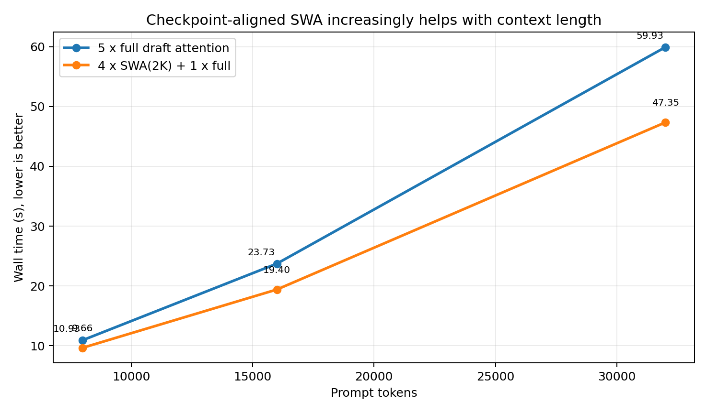
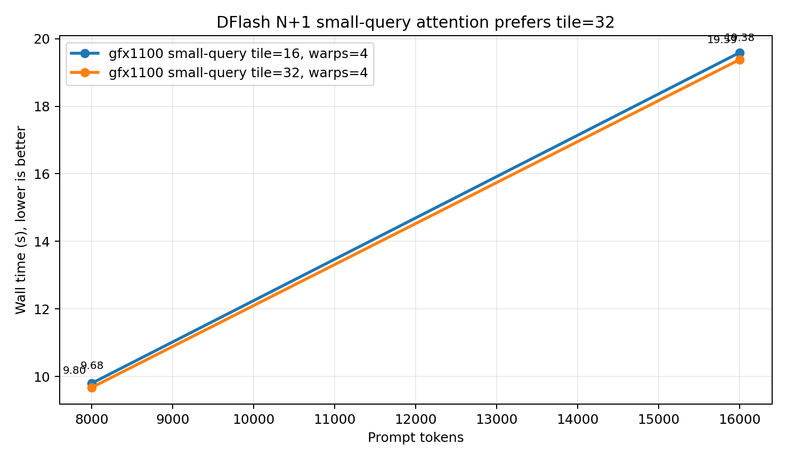
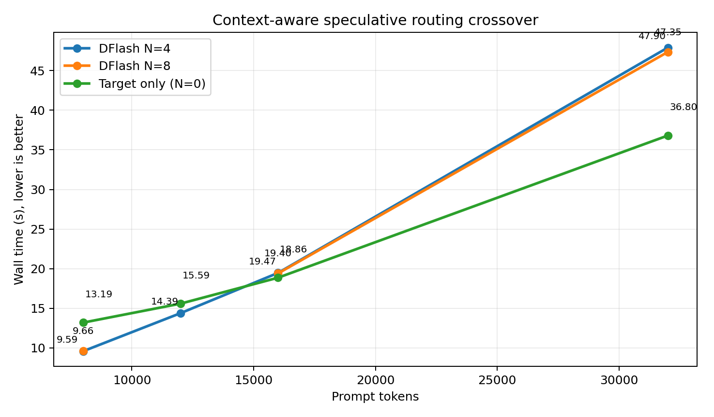
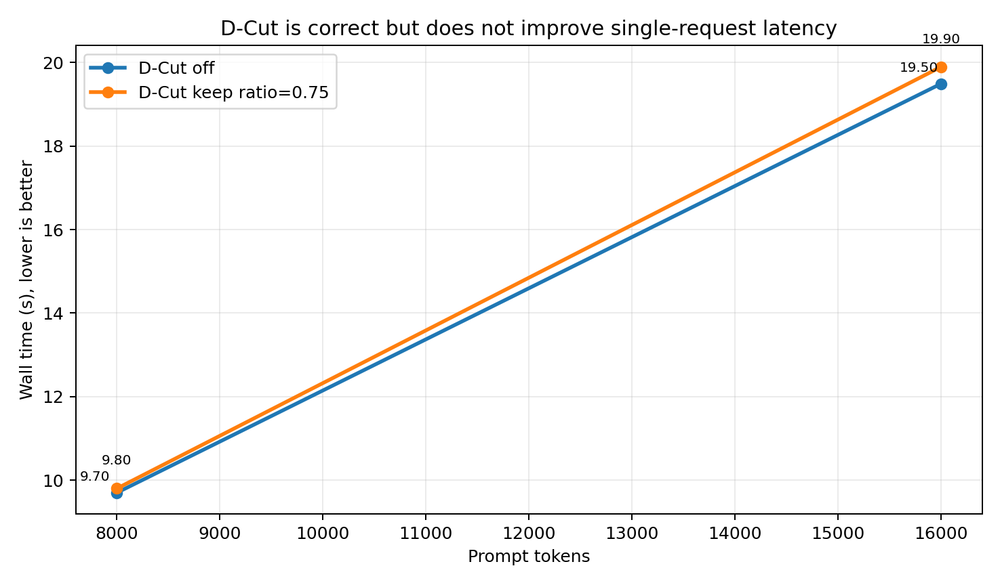
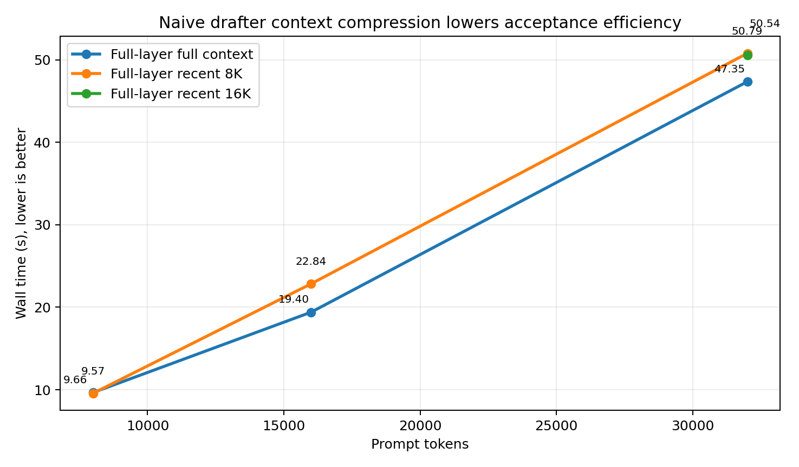

# W7900 DFlash 五路线优化实验总结

## 1. 实验目的与范围

本阶段针对 8 张 AMD Radeon PRO W7900（`gfx1100`）上 DFlash 随上下文增长而失效的问题，验证五条优化路线：恢复 checkpoint 的滑动窗口语义、调优非因果注意力热路径、按上下文自适应选择 speculative token 数、移植 D-Cut 置信度裁剪，以及压缩 drafter 上下文。实验同时补充了 draft tensor parallel、双 TP=4 在线路由和 Decode Context Parallel（DCP）可行性检查。

实验关注的不是单一 microbenchmark，而是以下闭环：功能正确、科研长文质量通过、热态端到端可复现，并能解释为什么某项优化有效或无效。

## 2. 环境与统一配置

| 项目 | 配置 |
|---|---|
| GPU | 8 x Radeon PRO W7900, `gfx1100`, 每卡 48 GiB |
| ROCm / PyTorch | ROCm 7.14 / PyTorch 2.11 |
| vLLM | `0.23.1.dev1`, main `63e78ce3652f4f94e9f484f40db71ca4cf019f21` |
| Target | Qwen3.6-27B AWQ-INT4, RDNA3 W4A16 后端 |
| Drafter | Qwen3.6-27B-DFlash, 5 层 |
| 主测试配置 | target TP=4, draft TP=1, FP8 KV, eager, max length 32K |
| 质量门禁 | Nowcast3D 科研长文事实题，输出上限 512 tokens，`QA=4/4` |

除专门标注的冷启动可靠性实验外，表中均为热态重复的均值。失败请求保留在 `all_runs.csv`，但不进入速度均值。

## 3. 路线一：恢复 DFlash 的混合 SWA 语义

DFlash checkpoint 明确包含 4 个 `sliding_attention` 层和 1 个 `full_attention` 层，窗口为 2048。旧 vLLM 路径没有把该语义完整传递给 drafter，实际运行成 5 个 full-attention 层。本阶段基于上游 PR #47914、#48113 的实现恢复 V2 runner 下的多 KV group 混合 SWA，并用 `VLLM_DFLASH_FORCE_FULL_ATTN` 完成同源码 A/B。



| Prompt | 5 x full | 4 x SWA(2K) + 1 x full | 时延下降 |
|---:|---:|---:|---:|
| 8K | 10.93 s | 9.66 s | 11.6% |
| 16K | 23.73 s | 19.40 s | 18.2% |
| 32K | 59.93 s | 47.35 s | 21.0% |

SWA 收益随上下文长度增长，且接受率没有下降。原因不仅是 4 层 attention 的读取范围从全上下文降到最近 2048 tokens，还在于运行语义重新与 checkpoint 训练分布一致。该路线是五条路线中收益最大且最稳定的一项。

## 4. 路线二：gfx1100 非因果 small-query attention

最新 main 已包含 PR #44652 的等价能力，Triton unified attention 支持非因果与 per-sequence causal，因此 DFlash 的 `N+1` query 可以进入统一内核。ROCM_ATTN 与 Triton 的阶段性特征不同：

| Prompt | Triton wall | ROCM_ATTN wall | Triton decode 阶段 | ROCM_ATTN decode 阶段 |
|---:|---:|---:|---:|---:|
| 8K | 9.66 s | 10.05 s（仅热态有效请求） | 5.58 s | 7.00 s |
| 16K | 19.40 s | 19.13 s | 8.91 s | 12.63 s |

ROCM_ATTN 的 target prefill 更快，因此 16K 总 wall 略低 1.4%；但 Triton 在 TTFT 之后的 DFlash decode 阶段快约 20% 至 30%。更重要的是，ROCM_ATTN 冷首请求出现过 0% acceptance、`QA=0/4` 和 83.4 s 异常，而 Triton 冷首请求即正确。两种 backend 目前又使用不同 KV 物理布局，不能在同一服务内直接组合。因此推荐全 Triton 作为可靠主路径，而不是用不安全的 KV alignment 绕过补丁混用 backend。

针对 `head_dim=128, GQA=4, max_seqlen_q<=9` 的 DFlash/target verification 热路径，本阶段加入 shape-scoped tile/warps 开关，而不影响普通长 prompt prefill。



| 配置 | 8K | 16K |
|---|---:|---:|
| tile=16, warps=4 | 9.80 s | 19.59 s |
| tile=32, warps=4 | **9.68 s** | **19.38 s** |
| tile=32, warps=8 | - | 19.46 s |

small-query 热路径的最优值是 `tile=32, warps=4`。这与普通长 prefill 的 `tile=16` 最优结论并不冲突，而是说明两种 shape 域需要分别调度：长 prefill 受寄存器压力影响更大，DFlash 的少量 query 则需要更大的 KV tile 保持有效带宽。

## 5. 路线三：上下文感知的 N=0/4/8 调度



| Prompt | Target only, N=0 | DFlash N=4 | DFlash N=8 | 最优模式 |
|---:|---:|---:|---:|---|
| 8K | 13.19 s | **9.59 s** | 9.66 s | N=4 |
| 12K | 15.59 s | **14.39 s** | - | N=4 |
| 16K | **18.86 s** | 19.47 s | 19.40 s | N=0 |
| 32K | **36.80 s** | 47.90 s | 47.35 s | N=0 |

N=4 与 N=8 的差异始终小于约 1.2%，真正重要的调度决策是是否启用 DFlash。8K 时 N=4 相比 target-only 降低 27.3% wall time；12K 仍降低 7.7%；16K 起 target-only 反超，32K 时 DFlash N=8 比 target-only 多耗时 28.7%。交叉区间位于 12K 至 16K，在线路由阈值取 14K。

当前 vLLM 的 dynamic speculative decoding 主要按 batch size 调度，不能直接按 prompt length 切换 N。本阶段实现了轻量 OpenAI-compatible 路由器，在两组同 NUMA 的 TP=4 服务之间选择：

```text
prompt <= 14K 且 batch=1  -> DFlash N=4, GPUs 0-3
prompt > 14K 或 batch>1   -> target-only, GPUs 4-7
```

双服务实测中，8004-token 请求两次均路由 DFlash，wall 为 9.74/9.50 s；16004-token 请求两次均路由 target-only，wall 为 19.39/19.21 s；四次均为 `QA=4/4`。响应头和日志均保存实际 token 数与路由结果。

## 6. 路线四：D-Cut 置信度裁尾

本阶段移植了上游 PR #47131。原 PR 仅支持 V1 runner，而混合 SWA 需要 V2 runner，因此进一步实现了 V2 路径的 logits confidence、`dcut_keep_lens` 异步回传和 scheduler 截断。上游纯逻辑测试为 19 passed；9 个 scheduler fixture 因离线缺少 `facebook/opt-125m` 而未执行。V2 在线端到端功能与质量门禁通过。



| 场景 | D-Cut off | keep ratio=0.75 | 变化 |
|---|---:|---:|---:|
| 8K, 单请求 | 9.70 s | 9.80 s | 慢 1.0% |
| 16K, 单请求 | 19.50 s | 19.90 s | 慢 2.1% |
| 6.3K, 并发 4 | 16.24 s | 16.40 s | 慢 1.0% |

keep ratio 实测为 0.778，功能符合预期；但减少 target verification 宽度的收益不足以覆盖 keep-length 回传、同步和调度开销。D-Cut 在单请求和并发 4 均无收益，因此默认关闭。

## 7. 路线五：压缩 drafter 上下文

为避免改变 4 个已按 checkpoint 设置为 2K SWA 的层，本实验只压缩唯一 full-attention draft layer；target 始终读取全上下文并做精确验证。



| Prompt | Full-layer 全上下文 | 最近 8K | 最近 16K |
|---:|---:|---:|---:|
| 8K | 9.66 s | 9.57 s | - |
| 16K | 19.40 s | 22.84 s | - |
| 32K | 47.35 s | 50.79 s | 50.54 s |

压缩不会改变 target 最终质量，所有请求仍为 `QA=4/4`；但 16K 的 8K-window 退化 17.7%，32K 的 8K/16K-window 分别退化 7.3%/6.7%。日志显示后部候选接受率明显下降，节省的 draft attention 计算被更多 target 拒绝与重算抵消。简单 recent-window 压缩不进入推荐配置。

## 8. 额外多卡路线

### 8.1 Draft tensor parallel

| Prompt | draft TP=1 | draft TP=4 | 结论 |
|---:|---:|---:|---|
| 16K | 19.38 s | 19.50 s | TP=4 慢 0.6% |
| 32K | 47.35 s | 47.56 s | TP=4 慢 0.5% |

5 层 drafter 较小，张量并行节省的计算不足以抵消额外 collective；推荐 `draft_tensor_parallel_size=1`。

### 8.2 Decode Context Parallel

DCP 对 Qwen3.6 的 GQA 要求 TP 大于 4 个 KV heads，因此只能测试 TP=8、DCP=2。当前环境无法进入性能测试：

1. `FLASH_ATTN + FP8 KV` 被明确拒绝，ROCm 路径不支持该 KV dtype。
2. 改为 auto KV 后，容器中的 `flash_attn 2.8.3` 仍不满足 vLLM DCP 所需的 paged-KV、softmax LSE 与扩展参数接口，启动报 `FlashAttention version not detected`。
3. Triton 和 ROCM_ATTN 当前不能返回 DCP 合并所需 LSE，强行跳过检查存在静默数值错误风险。

因此 DCP 在本镜像中属于明确的 backend 能力缺口，而不是一个已验证的优化项。

## 9. 最终推荐配置

面向混合长度工作负载，推荐以下 shape-aware 双实例系统：

| 上下文 | 服务配置 |
|---|---|
| <= 14K | AWQ4 target TP=4 + DFlash N=4 + draft TP=1；4 x SWA(2K) + 1 x full；Triton；small-query tile=32, warps=4 |
| 14K-32K | AWQ4 target-only TP=4；关闭 DFlash |
| 100K+ 科研长文 | 延续已验证的 BF16 TP=8 主路线，不使用 AWQ4 DFlash |

D-Cut 默认关闭，full draft layer 不做 recent-window 压缩。该结论不是否定 DFlash，而是把它限定在有净收益的 8K 至约 14K 区间；W7900 的 8 卡资源通过双 TP=4 服务实现短文低延迟与长文稳定性的并存。

## 10. 数据与复现材料

| 文件 | 内容 |
|---|---|
| `20260802_dflash_data/all_runs.csv` | 全部请求，包括失败请求 |
| `20260802_dflash_data/all_valid_runs.csv` | 67 次有效质量请求 |
| `20260802_dflash_data/aggregated_valid_runs.csv` | 34 个聚合配置点 |
| `20260802_dflash_data/dcut_concurrency4.csv` | D-Cut 并发 4 A/B |
| `../patches/vllm-main-63e78ce-w7900-dflash-five-routes.patch` | 可应用到固定 vLLM 基线的完整源码补丁 |
| `20260802_dflash_five_routes_raw.tgz` | 原始 manifest、结果、服务日志、失败栈和代码快照 |

所有关键数值均可由 `summarize_five_routes.py` 从原始 `summary.json` 重新生成。
